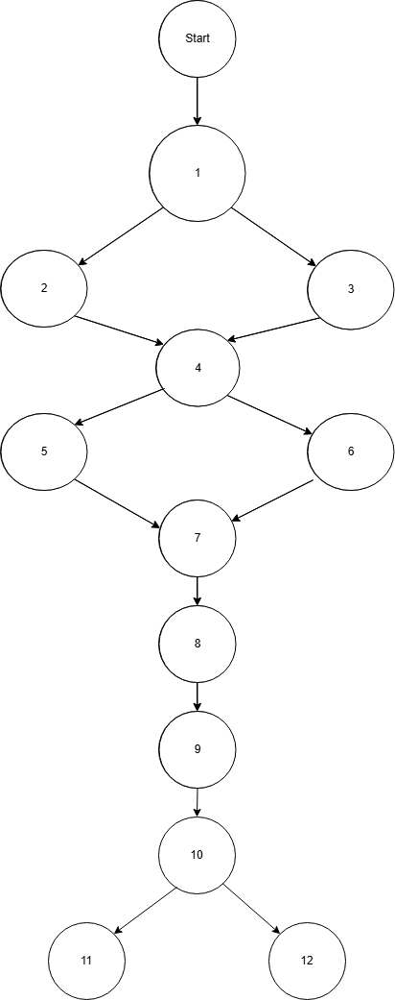
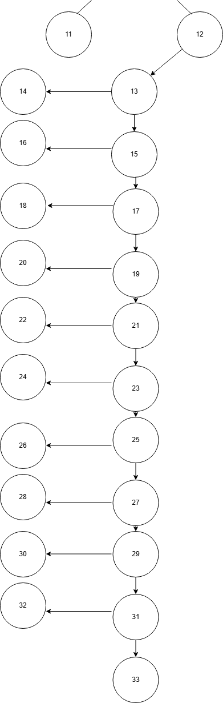
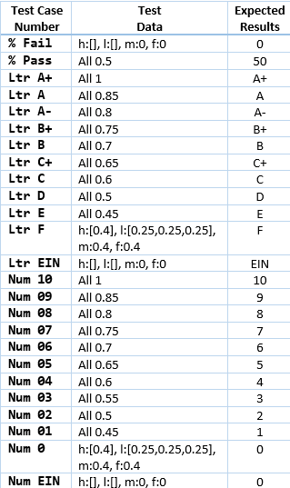
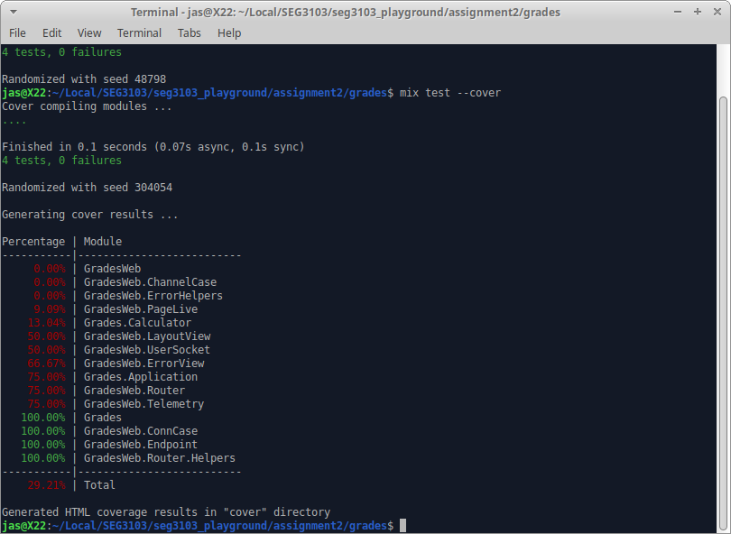
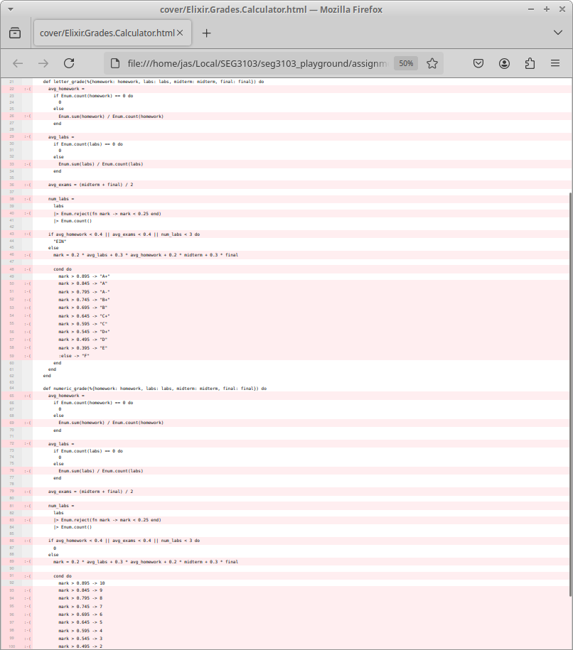
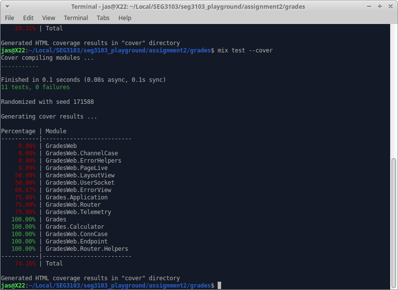
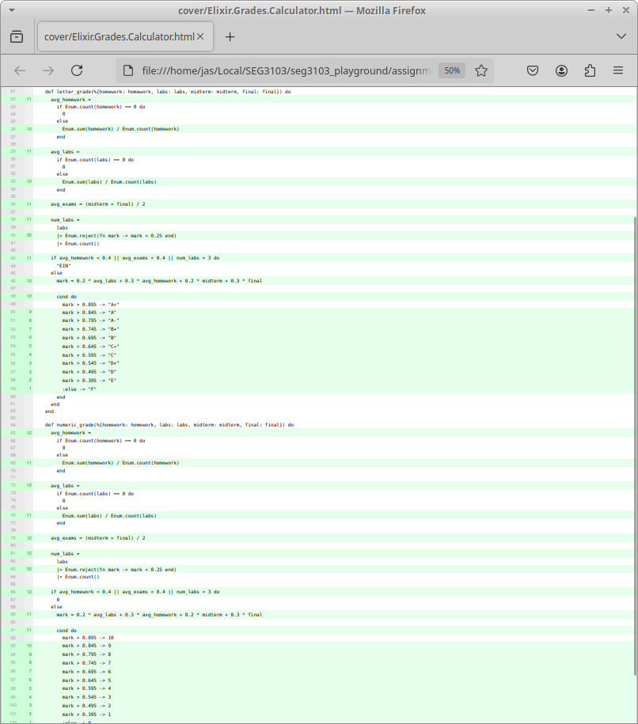

# Assignment 2

## Setup Server

`mix deps.get`  
`cd assets/`  
`npm install`  
`cd ..`  
`mix phx.server`  

## Simplified Control Flow Graph

  

## Whitebox Test Table

## Coverage Initially

## 100% Coverage

I was able to achieve 100% code coverage by adding appropriate tests.

## Refactoring

2.1: Refactor 1 - Added avg() function.
2.2: Refactor 2 - Added failed_to_participate() function.
2.3: Refactor 3 - Added calculate_grade() function.
2.4: Refactor 4 - Added number_of_labs() function.
2.5: Refactor 5 - Added avg_exams() function.