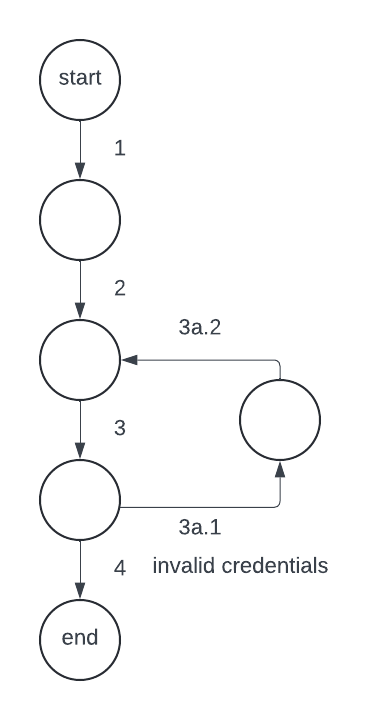
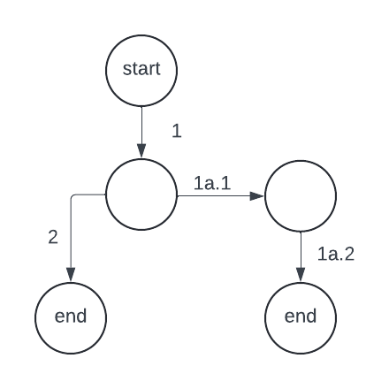

# Successful Tests Screenshots (Question 3)

# Question 1

## Give one positive and one negative test situation for each functional requirement.

### F1:
Positive - admin successfully adds book  
Negative - admin adds book with missing information  

### F2:
Positive - admin searchs for book with category and searchs for book with no category  
Negative - admin searchs for books and they are not shown  

### F3:
Positive - admin adds books to the order  
Negative - admin adds book and it doesn't order  

### F4: 
Positive - allow customers to view book order  
Negative - customer searches for book in cart and it is not there  

### F5: 
Positive - change the total of the order  
Negative - book cannot be removed from order  

### F6: 
Positive - system shows the order  
Negative - system shows the wrong totals for tax and shipping  

### F7: 
Positive - admin successfully removes book  
Negative - admin is unable to remove book from store  

### F8:
Positive - admin is able to authenticate and log in  
Negative - admin is unable to authenticate and log in  

### NF1:
Positive - only admin can remove or add books  
Negative - regular customer can remove or add books  

### NF2:
Positive - user successfully changes to selected language  
Negative - user is unable to change language  

# Question 2

## Derive test cases based on the use cases. For each use case give: A scenario graph, A set of scenarios ensuring branch coverage of the scenario graph, Abstract test cases corresponding to scenarios.

### Use Case 1

Scenarios:  
1) Admin logs in with valid credentials: 1 -> 2 -> 3 -> 4  
2) Admin logs in with invalid credentials: 1 -> 2 -> 3 -> 3a.1 -> 2 -> 3 -> 4  
  
Abstract Test Cases:  
TC1:  
Input - username: "admin" & password: "password"  
Output - checks credentials and admin is logged in  
  
TC2:  
Input - (1) username: "bobby" password: "john" (2) username: "admin"  
Output - (1) invalid (2) valid and admin is logged in  

### Use Case 2

Scenarios:  
1) Admin logs out: 1 -> 2 -> 3  
  
Abstract Test Cases:  
TC1:  
Input - user clicks "sign out"  
Output - user is logged out and sent to login page  

### Use Case 3

Scenarios:  
1) Book added: 1 -> 2  
2) Book added with wrong information: 1 -> 1a.1 -> 1 -> 2  
3) Book added with duplicated id: 1 -> 1b.1 -> 1 -> 2  
4) Book added with wrong information & duplicated id: 1 -> 1a.1 -> 1 -> 1b.1 -> 1 -> 2  
  
Abstract Test Cases:  
TC1:  
Input - admin clicks add  
Output - adds book to catalogue  
  
TC2:  
Input - (1) admin clicks add with missing book information (2) admin adds with correct information  
Output - (1) displays "Validation errors" (2) adds book to catalogue  
  
TC3:  
Input - (1) admin clicks add on book with existing id (2) admin clicks add on book with unique id  
Output - (1) displays "Book with same id already exist" error (2) adds book to catalogue  

### Use Case 4

Scenarios:  
1) Category shown: 1 -> 2  
2) All categories shown: 1 -> 1a.1  
3) No categories shown: 1 -> 1b.1  
  
Abstract Test Cases:  
TC1:  
Input - user searches for book category  
Output - displays book for certain category  
  
TC2:  
Input - user clicks search  
Output - all books are displayed  
  
TC3:  
Input - user searches for category that doesn't exist  
Output - displays "Sorry we do not have any item" error  

### Use Case 5

Scenarios:  
1) Book removed: 1 -> 2  
  
Abstract Test Cases:  
TC1:  
Input - admin clicks delete book  
Output - book is removed from catalogue  

### Use Case 6

Scenarios:  
1) Book added to order: 1 -> 2  
2) Books already in order: 1 -> 1a.1  
  
Abstract Test Cases:  
TC1:  
Input - user clicks button to add book to cart  
Output - adds book with specific id to cart  
  
TC2:  
Input - user clicks button to add book to cart several times  
Output - adds all books to cart  

### Use Case 7

Scenarios:  
1) Book order shown: 1 -> 2  
  
Abstract Test Cases:  
TC1:  
Input - user clicks on their cart  
Output - order page is shown to user  

### Use Case 8

Scenarios:  
1) Number of copies updated: 1 -> 2  
2) Book cost is 0 & gets removed from order: 1 -> 1a.1 -> 1a.2  
  
Abstract Test Cases:  
TC1:  
Input - user updates the amount of copies they want in their order  
Output - book copies are added and order cost is updated  
  
TC2:  
Input - user updates number of copies to 0  
Output - order is updated to remove book and update cost to 0  

### Use Case 9

Scenarios:  
1) Checkout shown: 1 -> 2  
  
Abstract Test Cases:  
TC1:  
Input - user clicks button to go to checkout  
Output - checkout page is shown  

### Use Case 10

Scenarios:  
1) Selected language shown: 1 -> 2  
  
Abstract Test Cases:  
TC1:  
Input - user selects a different language  
Output - page refreshes to display selected language  

