## Exercise 1:

| Test Case | Expected Results | Actual Results | Verdict (Pass, Fail, Inconclusive) |
| --- | --- | --- | --- |
| 1 | Successful registration | Successful registration | Pass |
| 2 | Successful registration | Successful registration | Pass |
| 3 | Successful registration | Successful registration | Pass |
| 4 | Successful registration | Successful registration | Pass |
| 5 | Err1 | Err1 | Pass |
| 6 | Err2 & Err 3 | Err2 & Err3 | Pass |
| 7 | Err4 | Err4 | Pass |
| 8 | Err5 | Err5 | Pass |
| 9 | Err6 | Err6 | Pass |
| 10 | Err7 | Err7 | Pass |
| 11 | Err8 | Err8 | Pass |
| 12 | Err9 | Err9 | Pass |
| 13 | Err10 | Err10 | Pass |
| 14 | Err11 | Err11 | Pass |

# Test Case 1 Input:

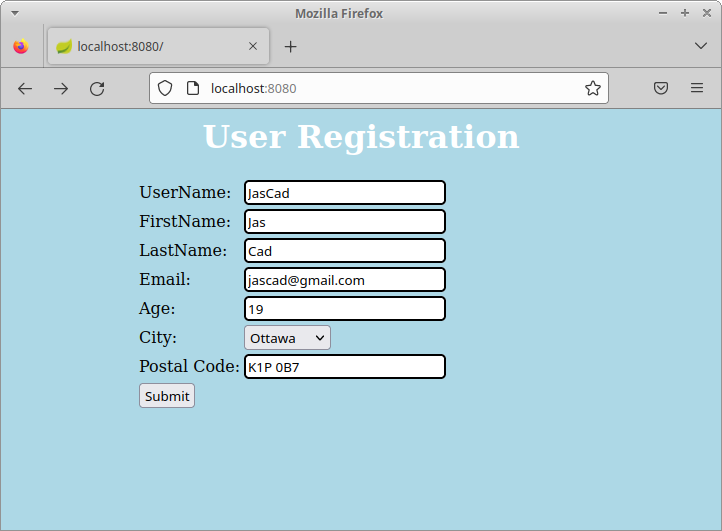

# Test Case 1 Output:

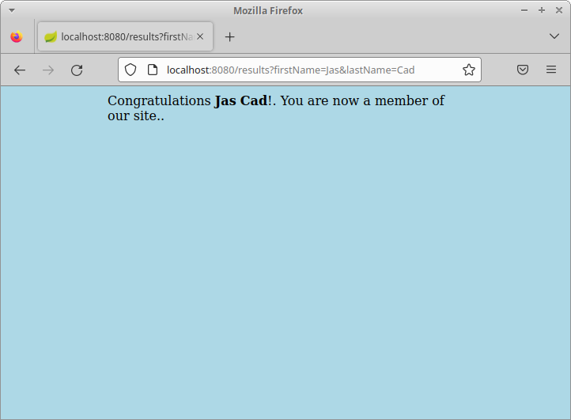

# Test Case 2 Input:

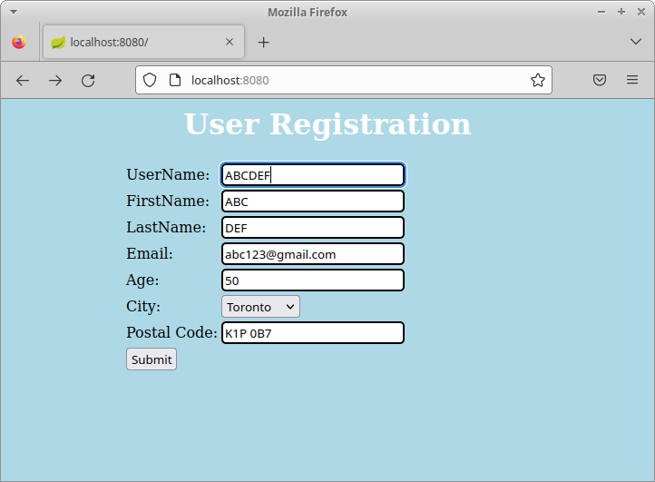

# Test Case 2 Output:

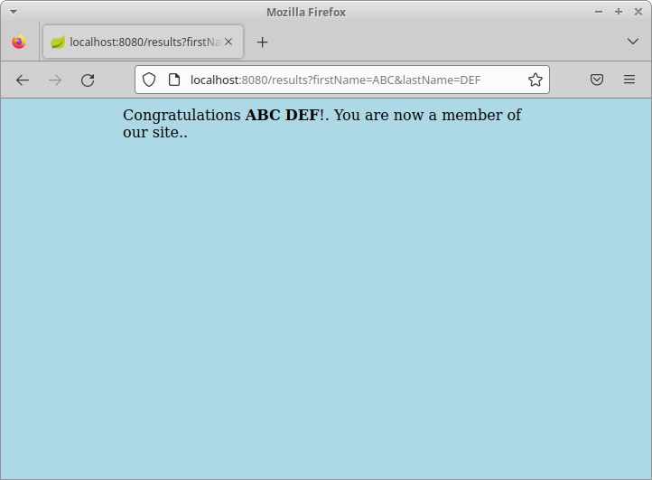

# Test Case 3 Input:

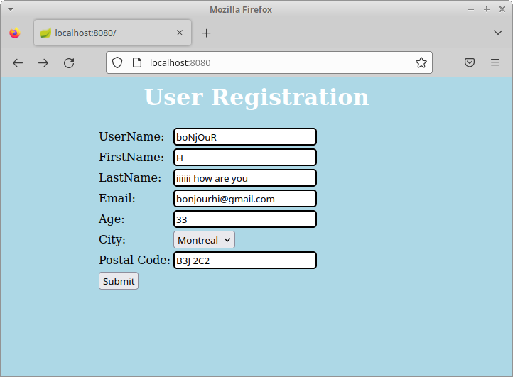

# Test Case 3 Output:

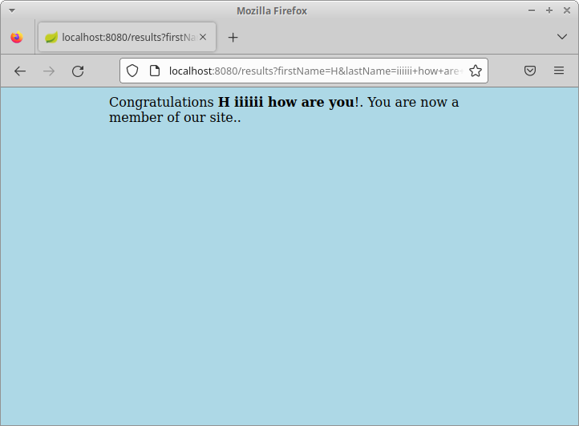

# Test Case 4 Input:

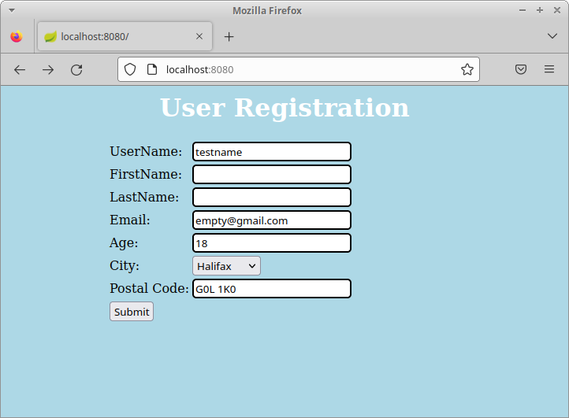

# Test Case 4 Output:

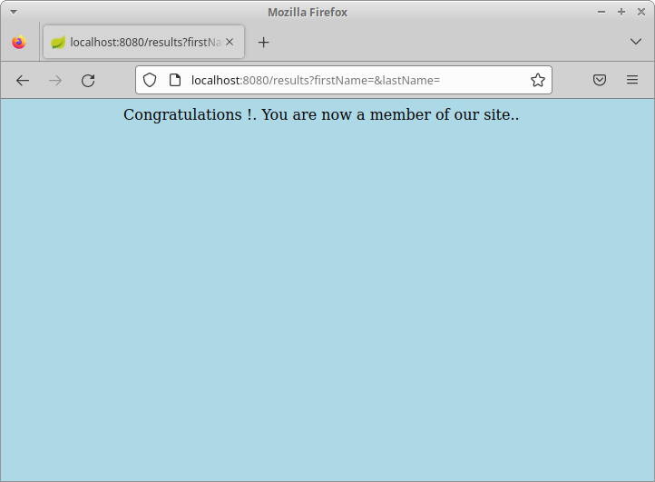

# Test Case 5 Result:

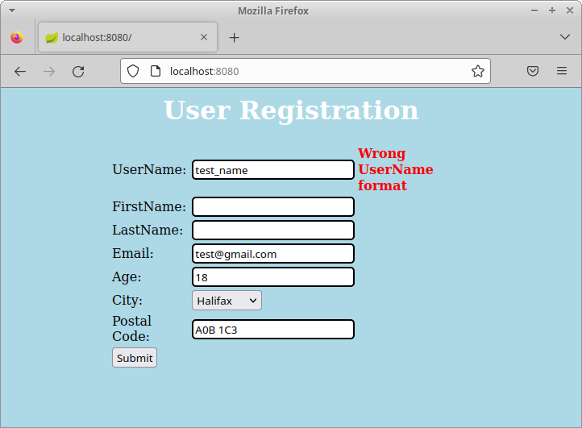

# Test Case 6 Result:

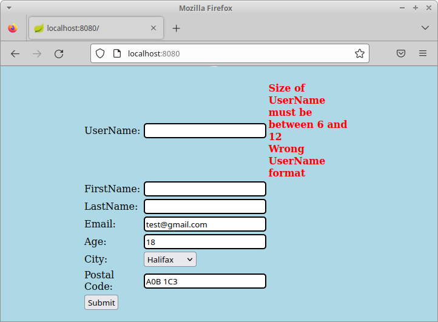

# Test Case 7 Result:

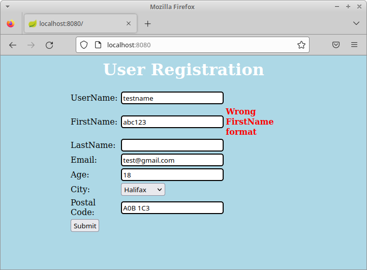

# Test Case 8 Result:

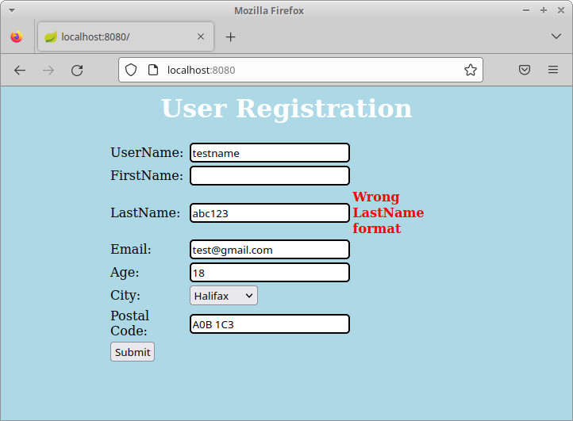

# Test Case 9 Result:

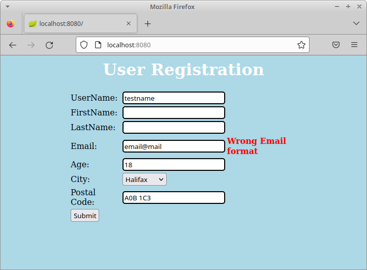

# Test Case 10 Result:

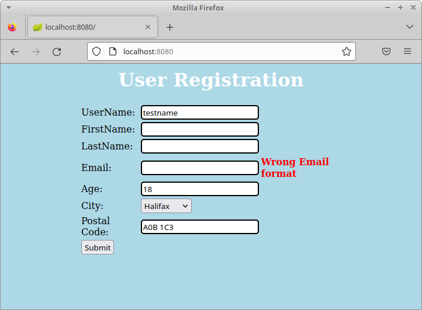

# Test Case 11 Result:

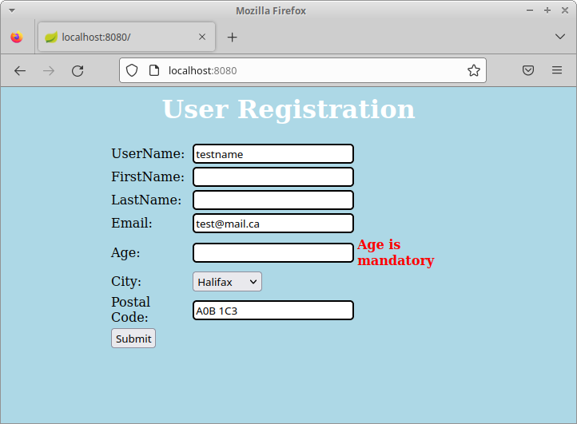

# Test Case 12 Result:

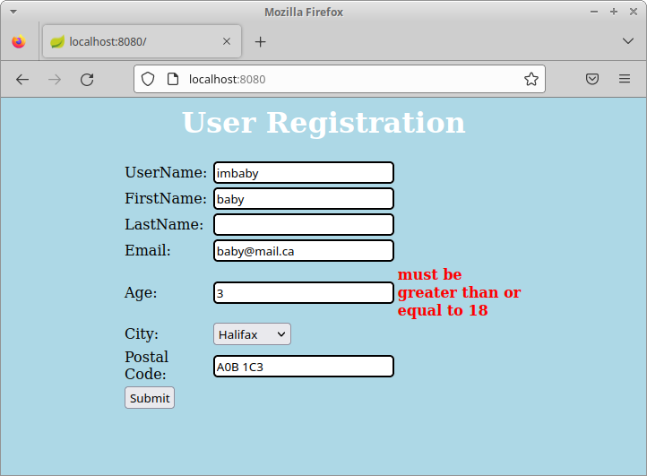

# Test Case 13 Result:

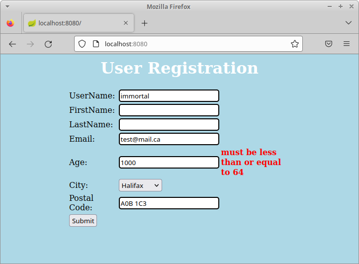

# Test Case 14 Result:

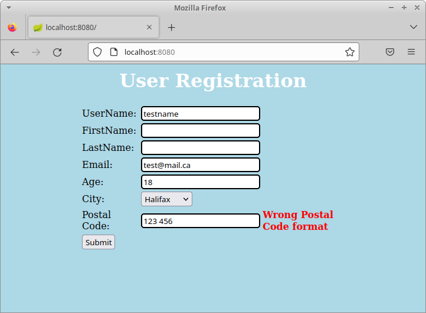

## Exercise 2:

# Test Case Results:

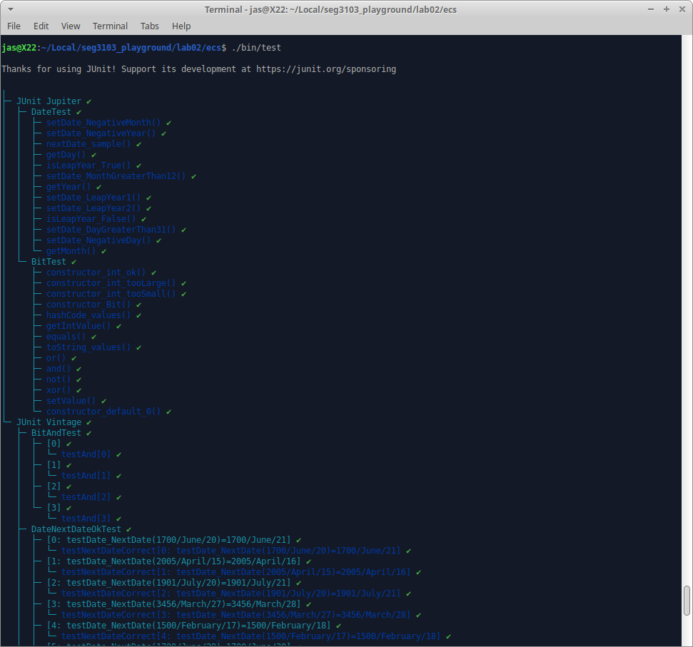
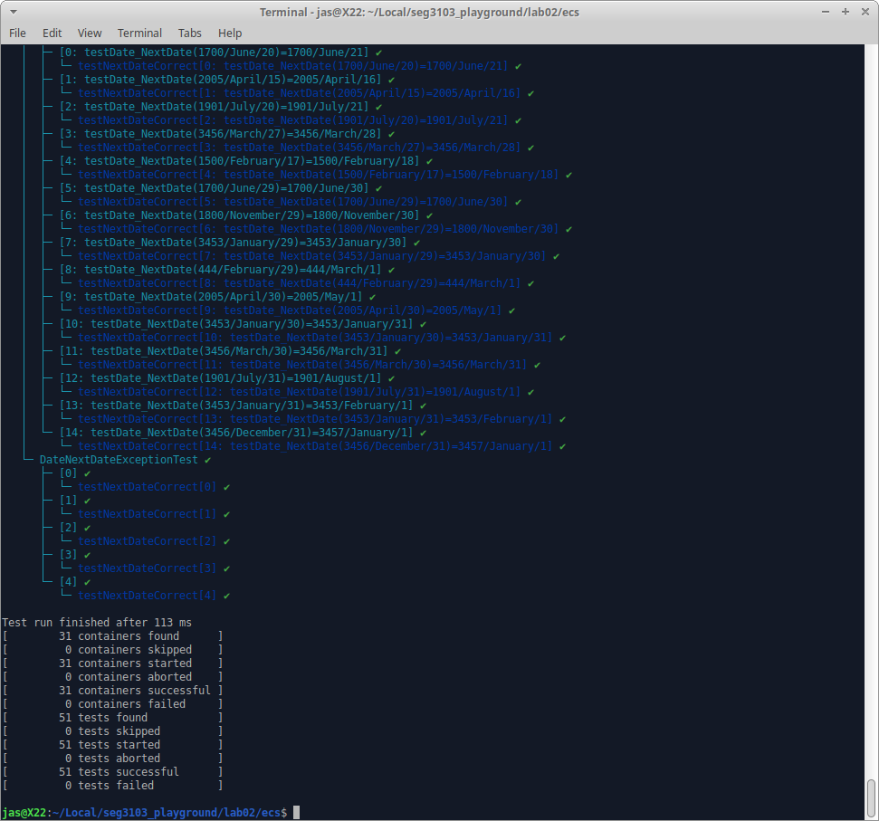
