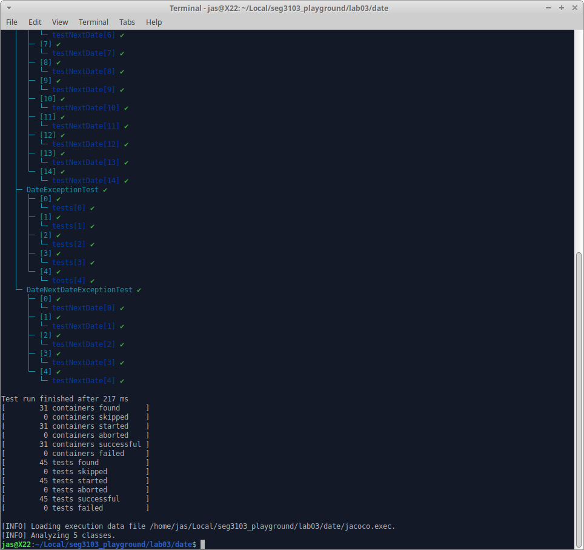
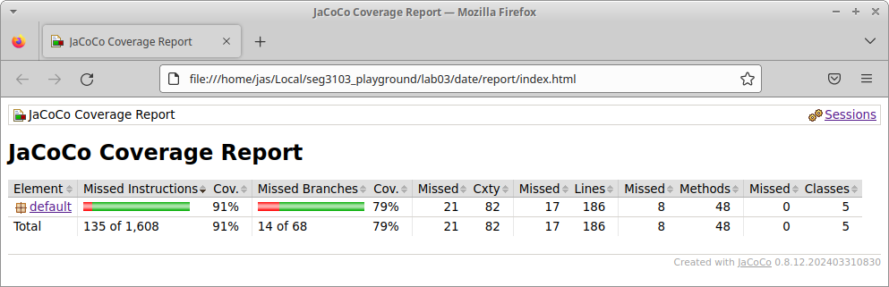
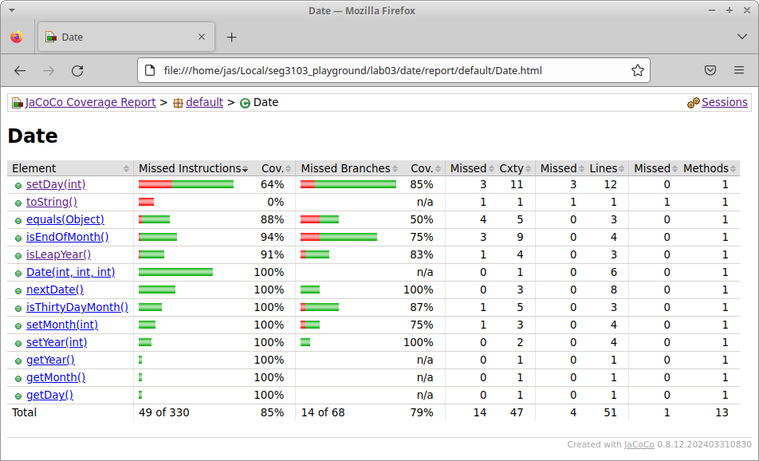
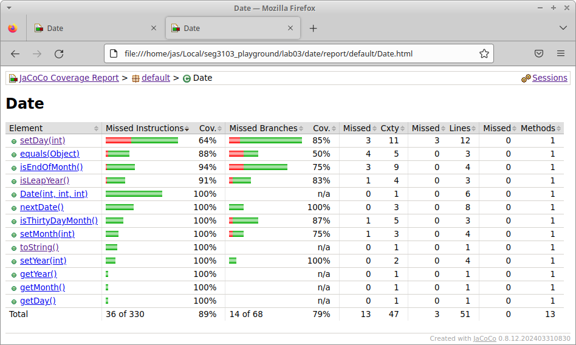
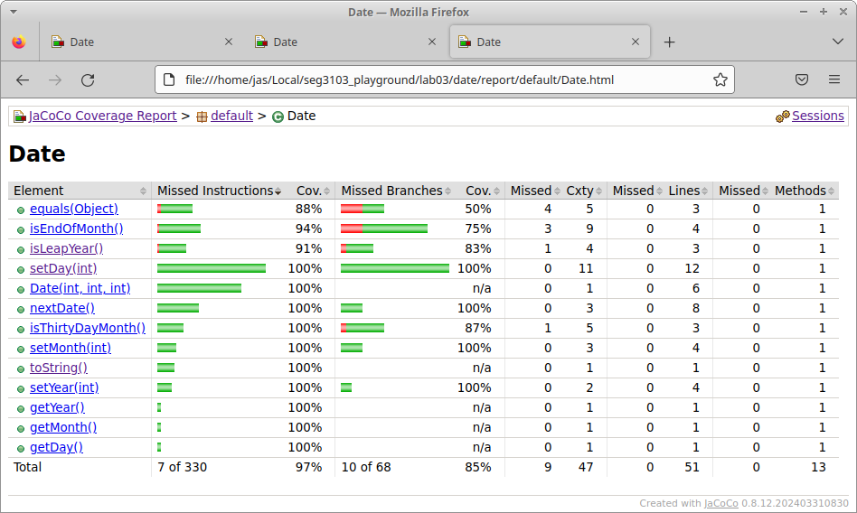
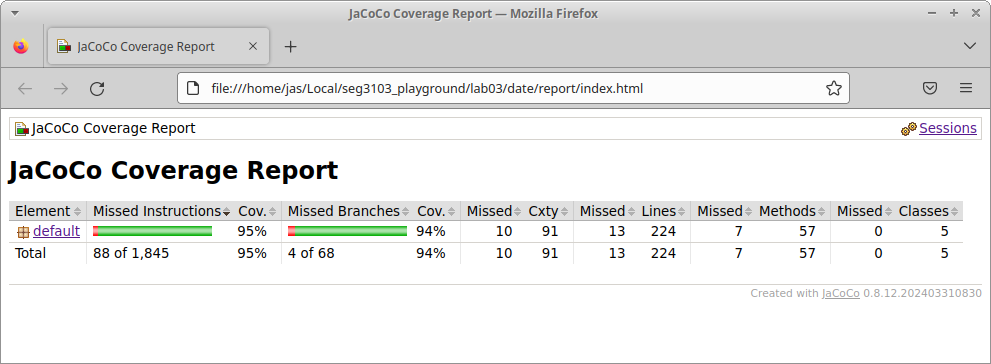
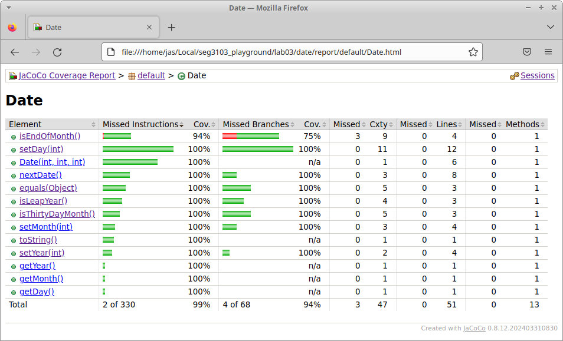
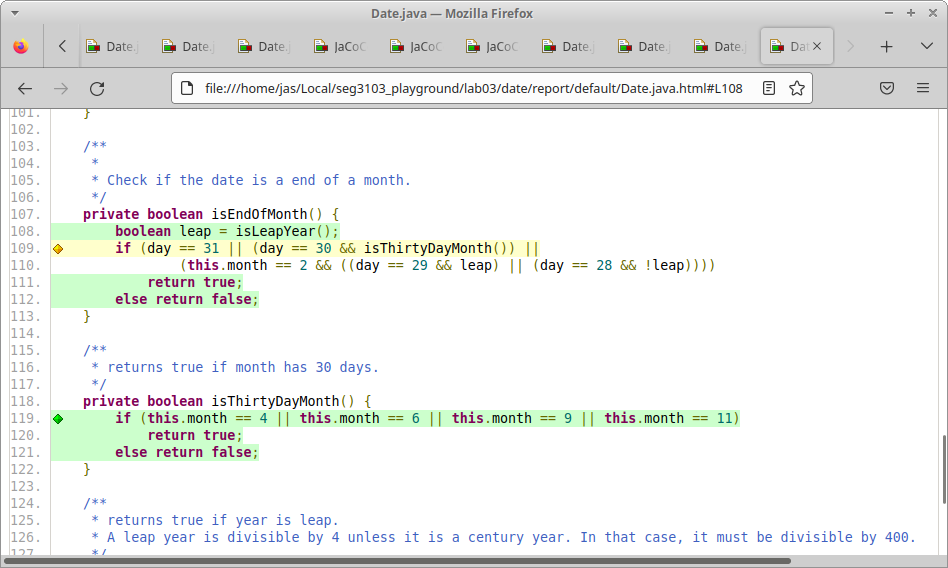
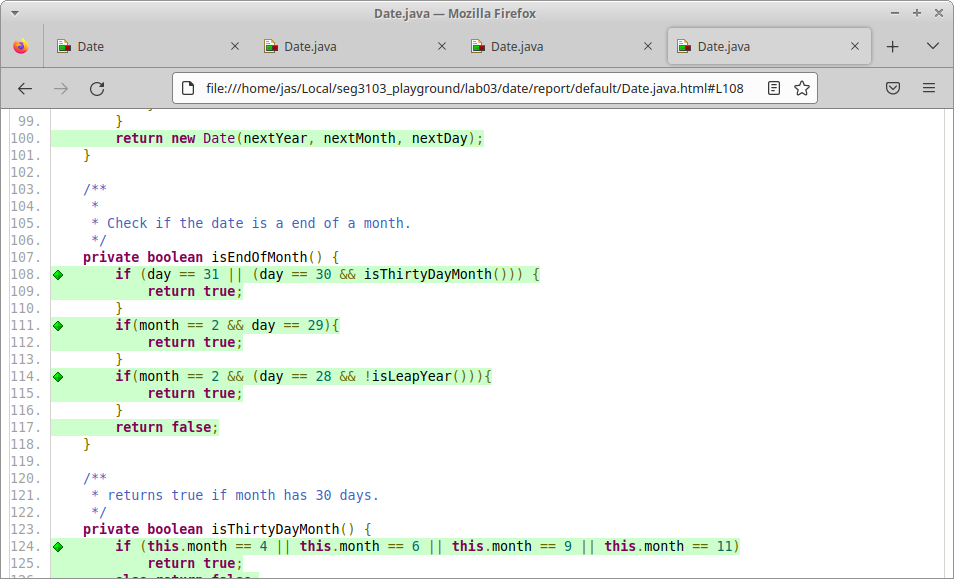
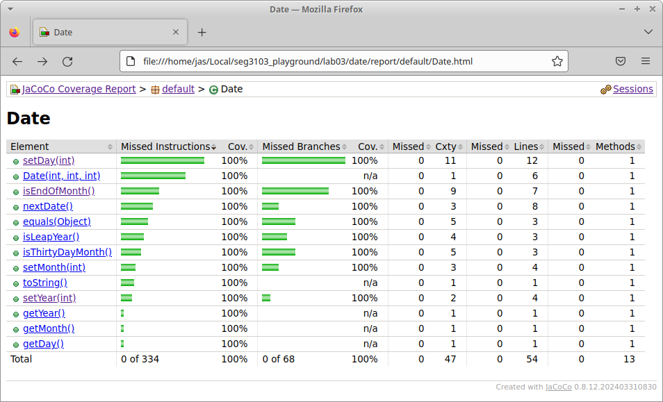

# Compile & Run Jacoco:

# Coverage = 91%:

This was the initial code I recieved, with a 91% coverage.

# Date Coverage = 91%:

# Date Coverage = 92%:

# Date Coverage = 94%:

# Date Coverage = 95%:

# isEndOfMonth Missing Branches:

After attempting to reach 100% coverage by creating tests,
I realized it would be impossible to cover all branches
of isEndOfMonth() without refactoring.

# Refactoring Successfully Covers Branches:

# Date Coverage = 100%:

