# TDD for "Fuzzy Math" Calculator

This calculator was inspired by the idea of fuzzy math, where the answer to a calculation is not what it should be, therefore, "fuzzy". I used lab 1 as a template for this calculator.

# Commit 1.1 - Fail:
Adding a sum function.

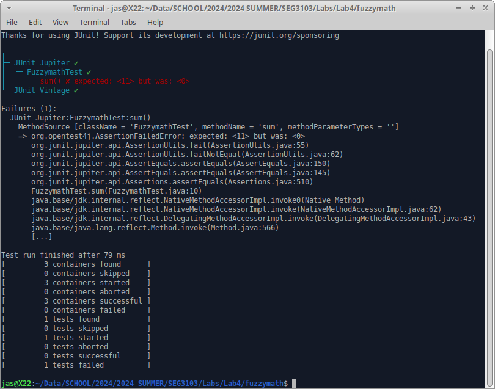

# Commit 1.2 - Pass:

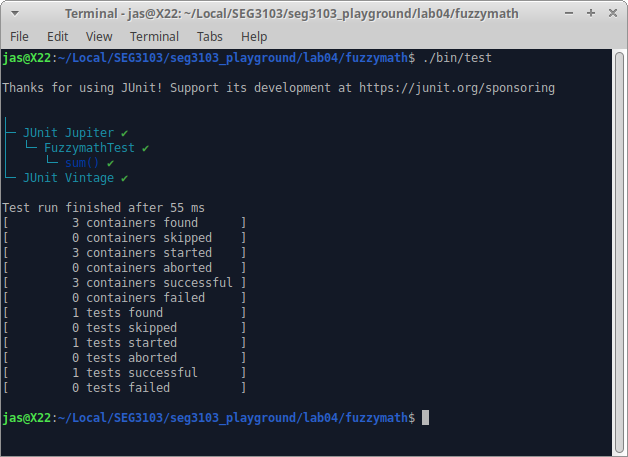

# Commit 1.3 - Refactor:

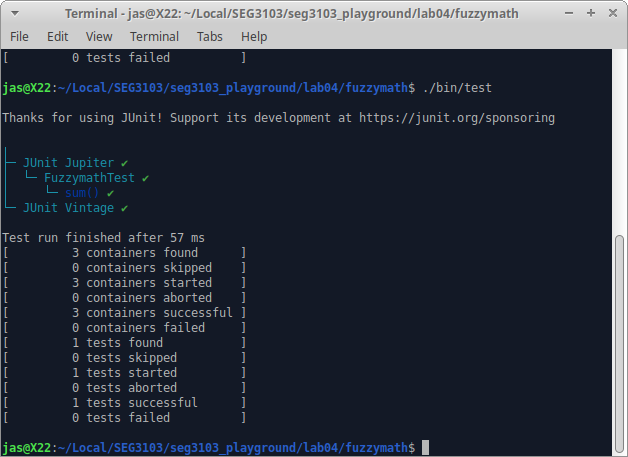

# Commit 2.1 - Fail:
Adding a difference function.

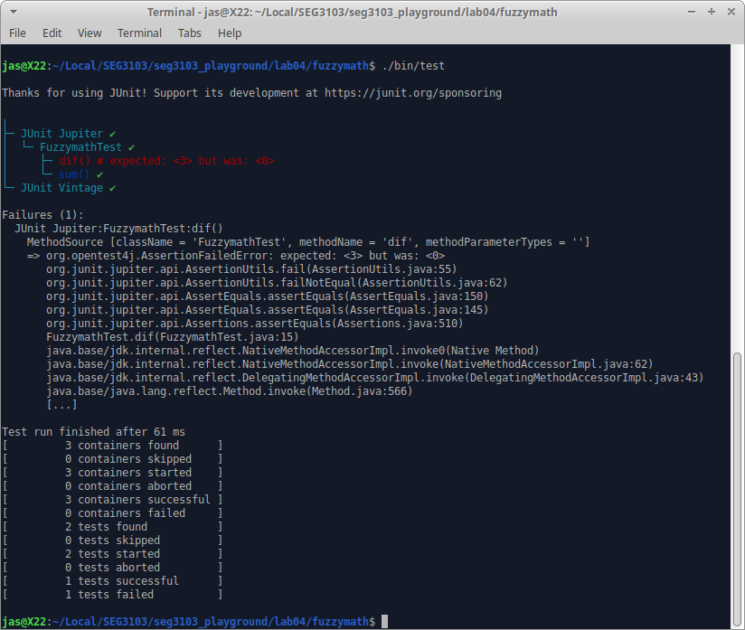

# Commit 2.2 - Pass:

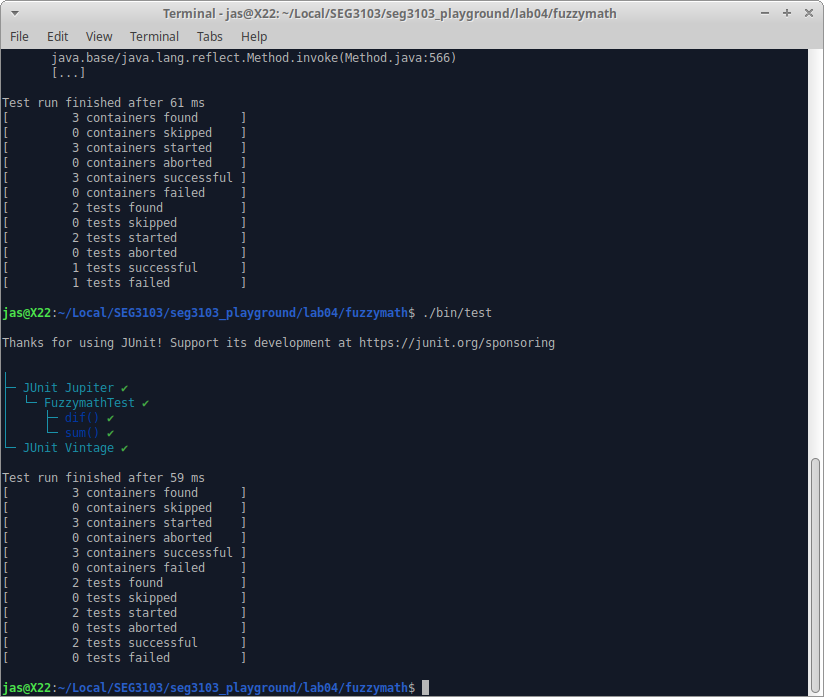

# Commit 2.3 - Refactor:

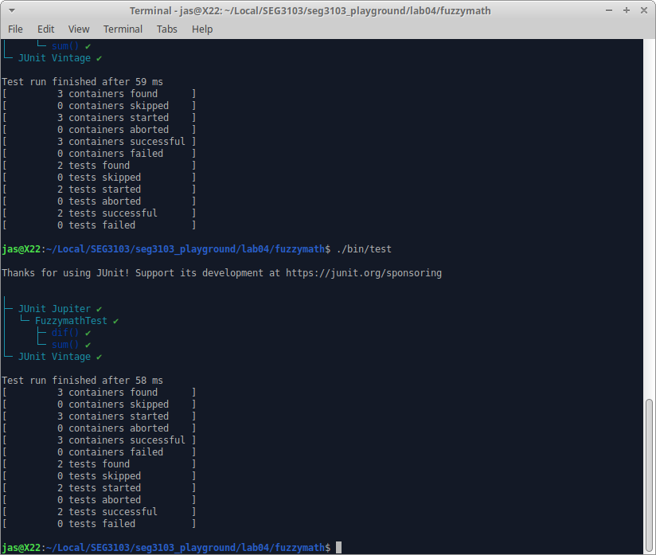

# Commit 3.1 - Fail:
Adding a product function.

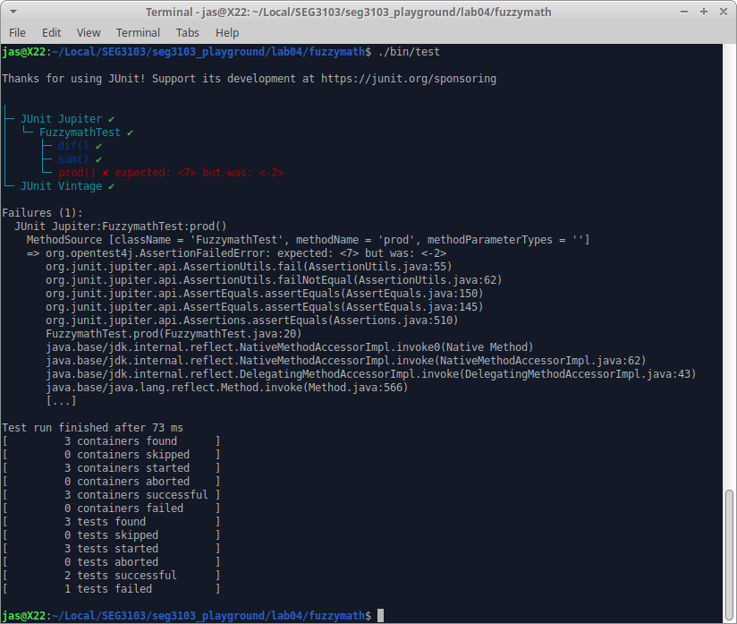

# Commit 3.2 - Pass:

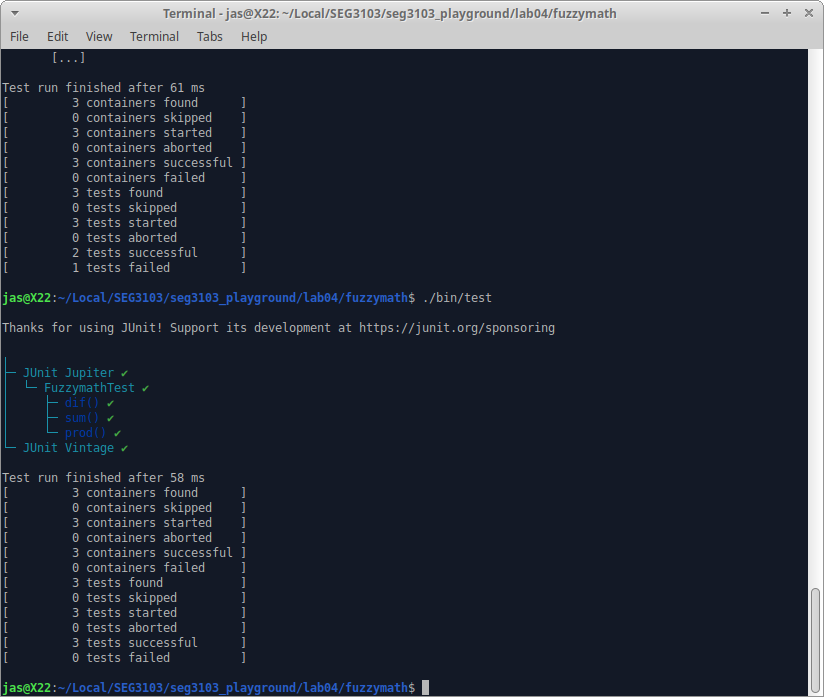

# Commit 3.3 - Refactor:

# Commit 4.1 - Fail:
Adding a quotient function.

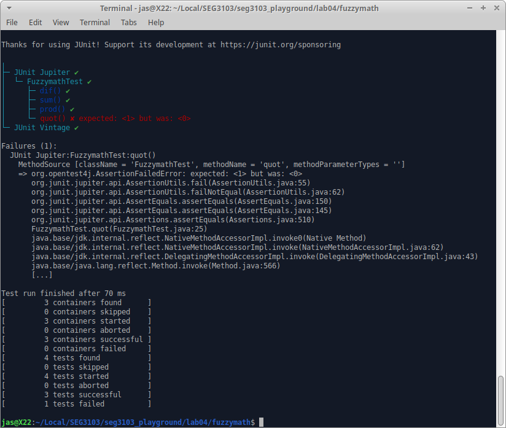

# Commit 4.2 - Pass:

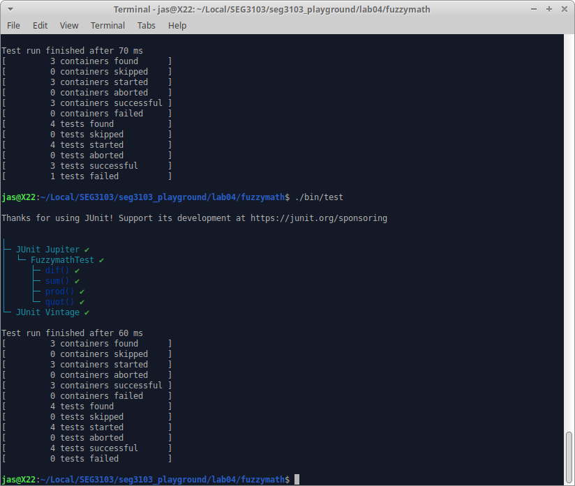

# Commit 4.3 - Refactor:

# Commit 5.1 - Fail:
Adding a modulo function.

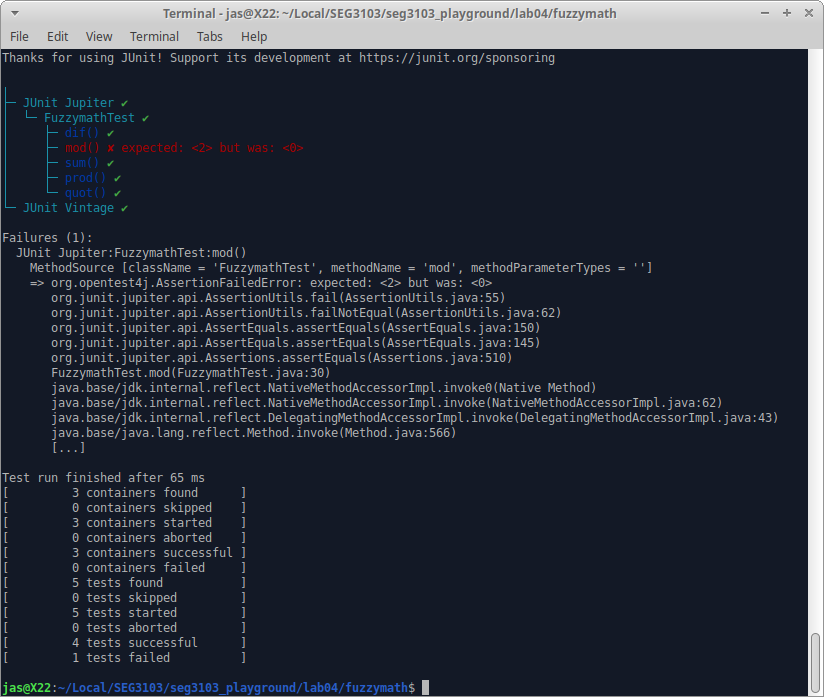

# Commit 5.2 - Pass:

# Commit 5.3 - Refactor:

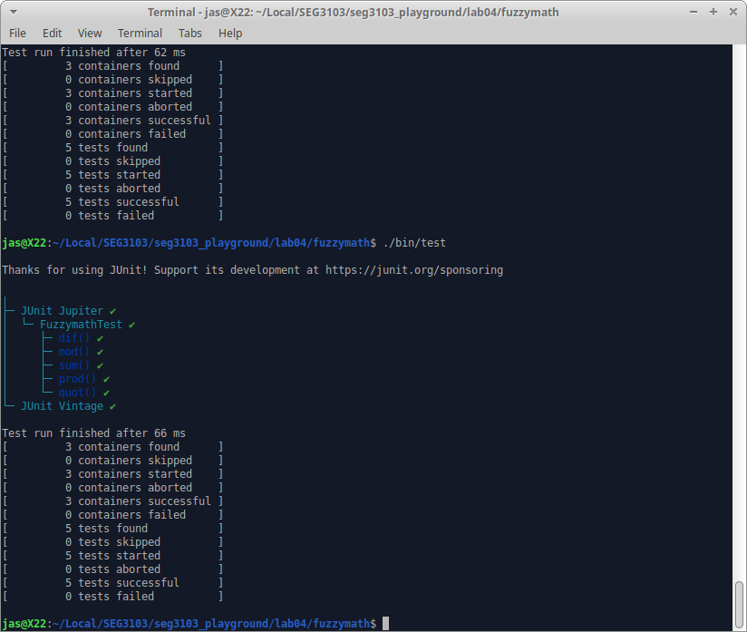

