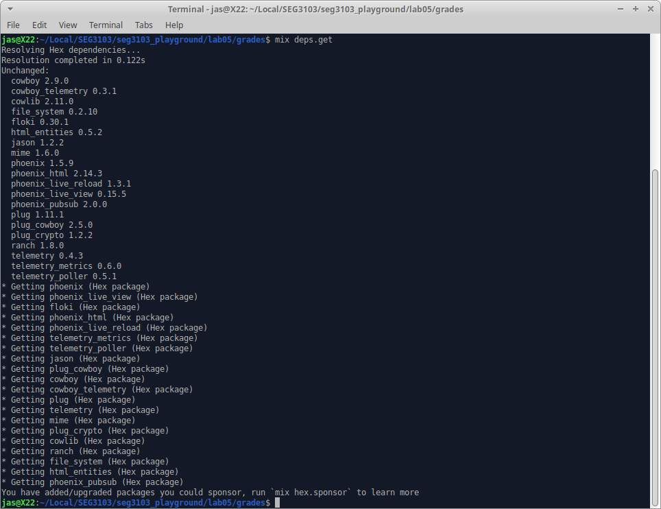
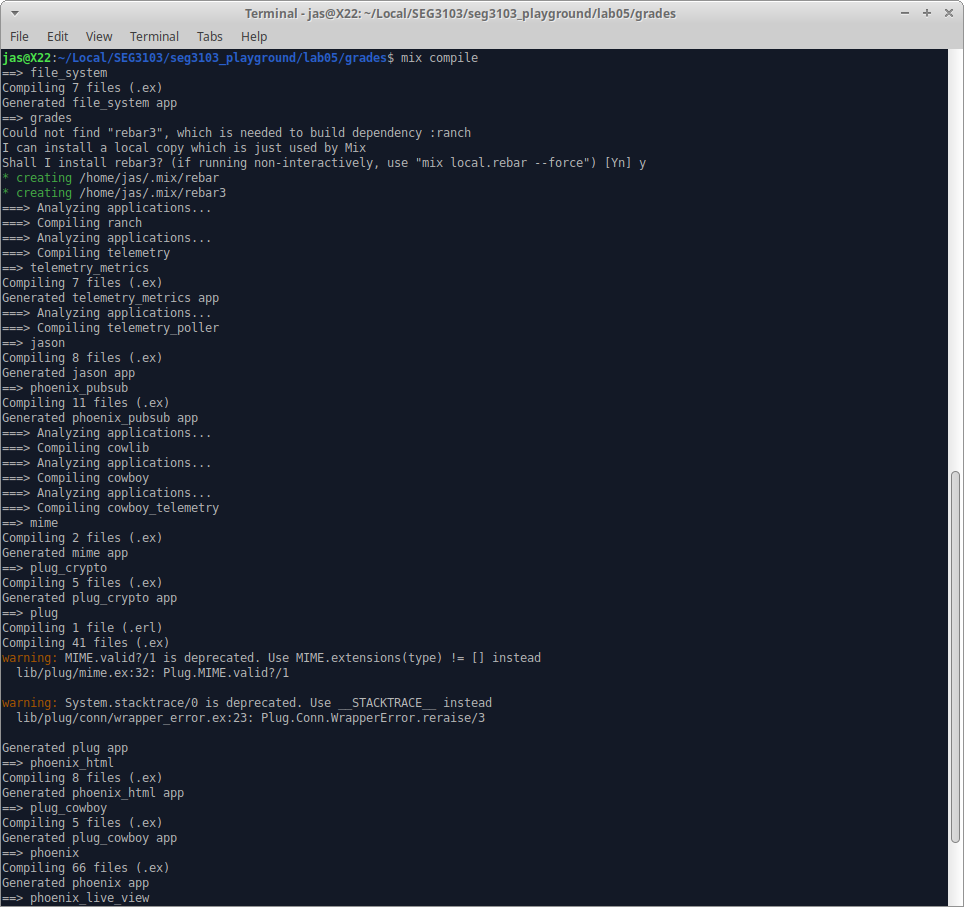
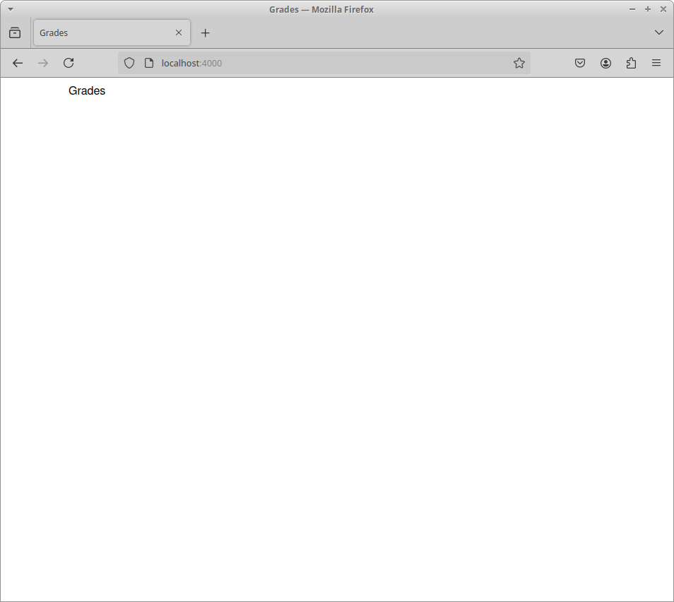
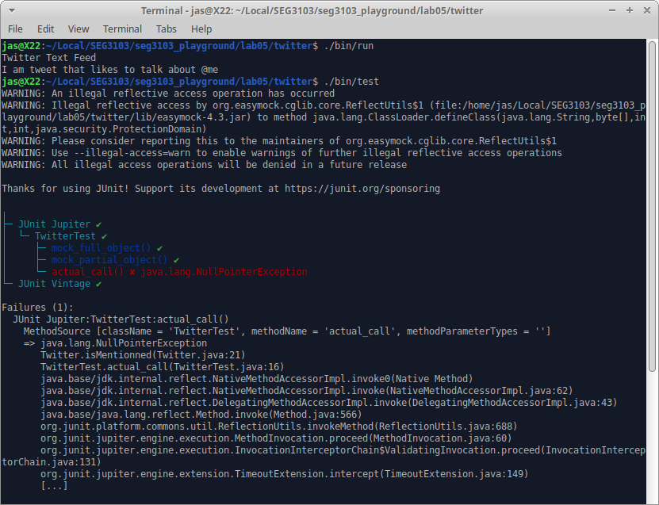
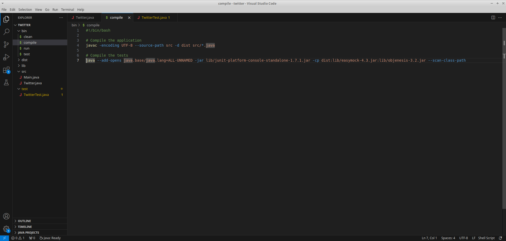
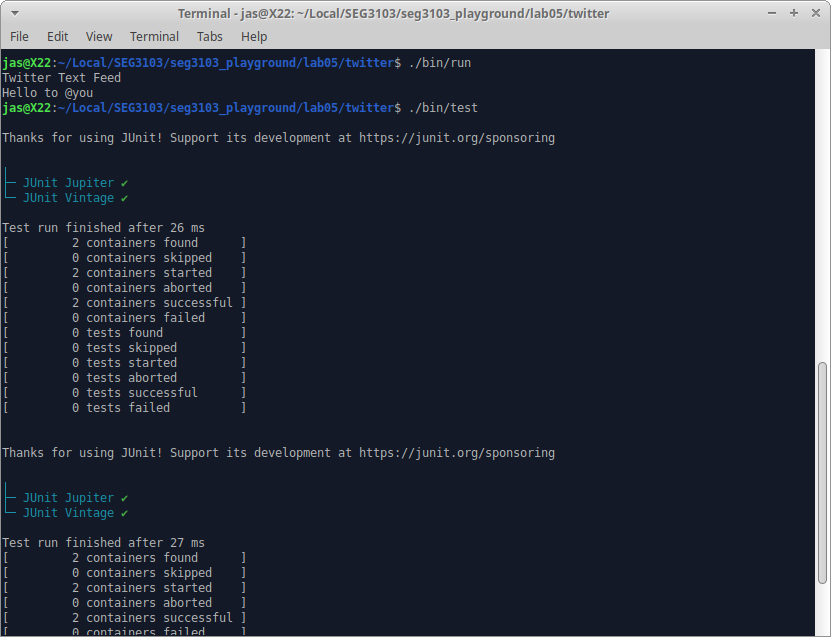

# Exercise 1: Grades

I used Unix/Ubuntu to complete this lab.

First I installed dependencies.

Then, I ran the command: 

`mix compile`  

Then I tried to launch the website, and there were two errors. One about inotify, and the other related to node.

I ran the command: 

`sudo apt install inotify-tools`  

...which solved one error.

Then I tried to fix the node issue:

`cd assets`  
`npm install`  

...Then I got many more errors, I tried to solve them by downloading python 2 and downgrading the node version from v20 to v14.
This got rid of the errors, but when I launched the website again, only the title appeared. 

I assume this is due to the libraries being old.

# Exercise 2: Twitter

I ran and compiled the tests.

There was an error, so I updated the compile file with the command given in the lab instructions.

Then, I ran the tests and it was successful.

