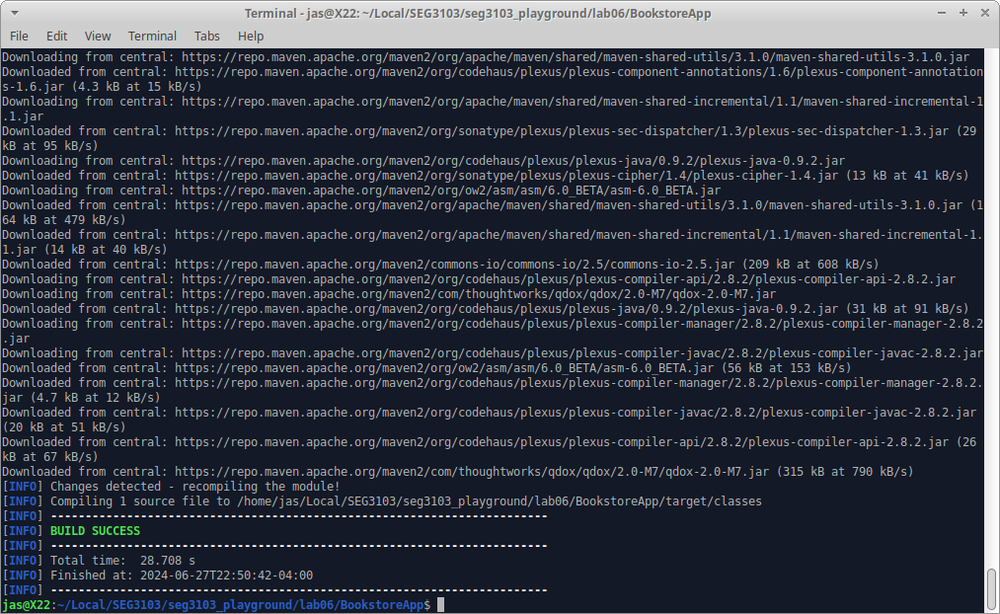
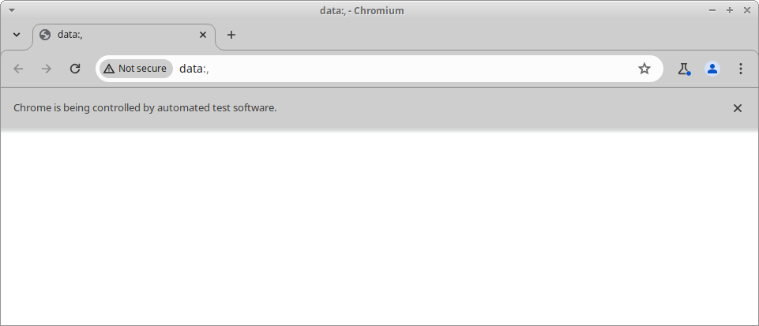

# Install Maven

`sudo apt install maven`  

# Compile App

`mvn compile`  

# Package App

`mvn package -DskipTests`  

# Launch App

# Launch Test

`mvn test`  

# Error Occurs

# Error

# Change Web

From Chrome to Firefox.

# Error Remains...

Selenium incompatible with Firefox on Unix.

# Install Chrome

Trying to see if Chrome is more stable and would work with Selenium.

Revert to Chrome WebDriver  

# Install Selenium IDE

# Test Successful

# Add Test

Adding test3 based on instructions. The test is for admin, where they can enter username and password. Then, the url changes to /login. Once successfully logged in, the url will be /admin.

# Run Test Success

