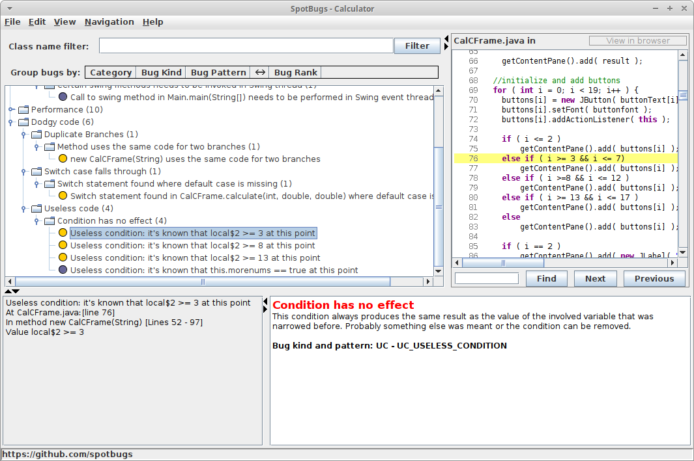

# SpotBugs Analysis

The point of this lab was to do static analysis of java code using the tool SpotBugs.

## Compile & Run Code

`./bin/run`  

## Run SpotBugs

`java -jar ./lib/spotbugs/lib/spotbugs.jar`

There were 18 bugs to begin with.  

## Solve Bugs

I went through the code and refactored to fix each error. Below I have included some screenshots and explanation.  

Useless Condition Error:  

Duplicate Branches Error:  

I refactored the code to deal with each error such as adding static, using parseDouble(), used equals() function instead of ==, etc. I recompiled after each refactoring until I was left with no bugs.  

