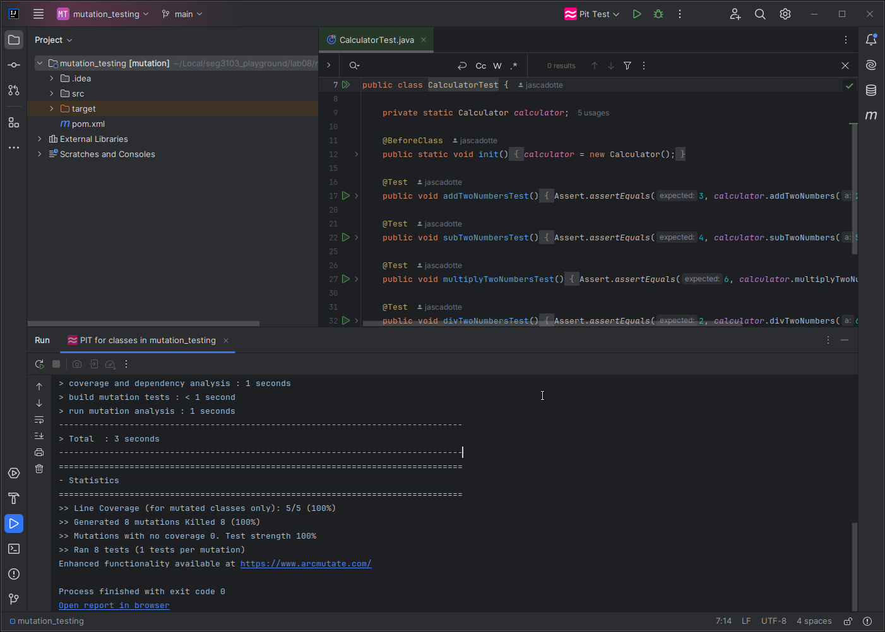
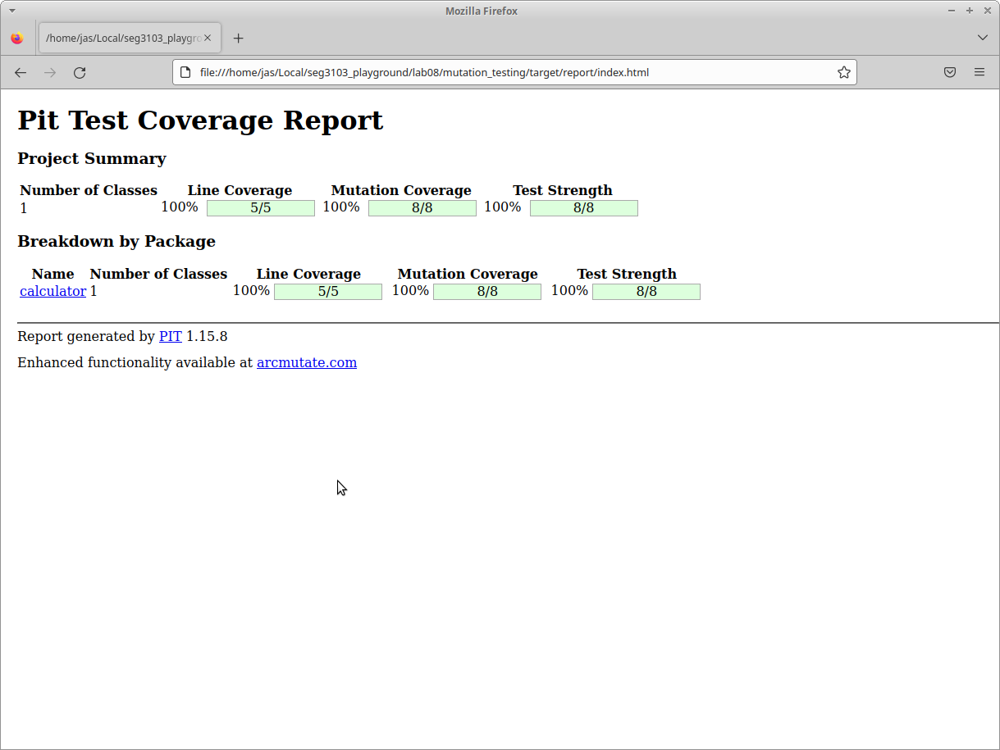
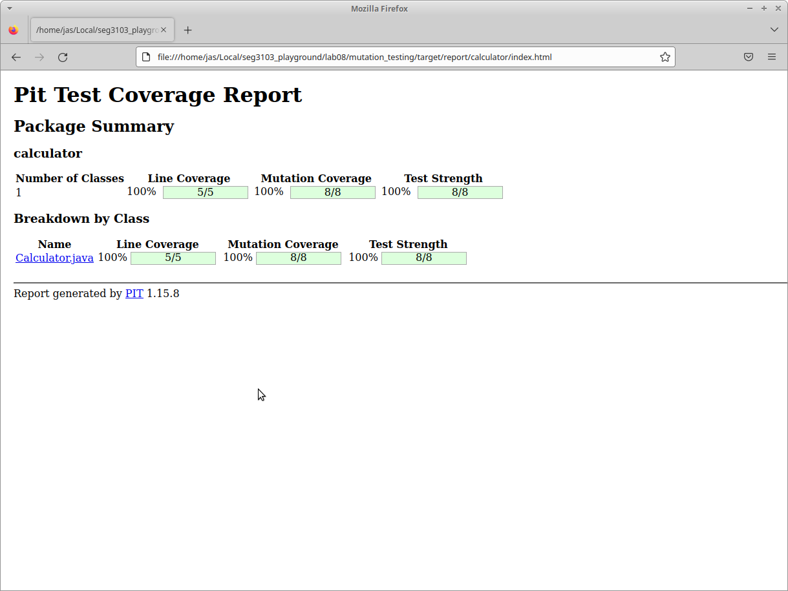
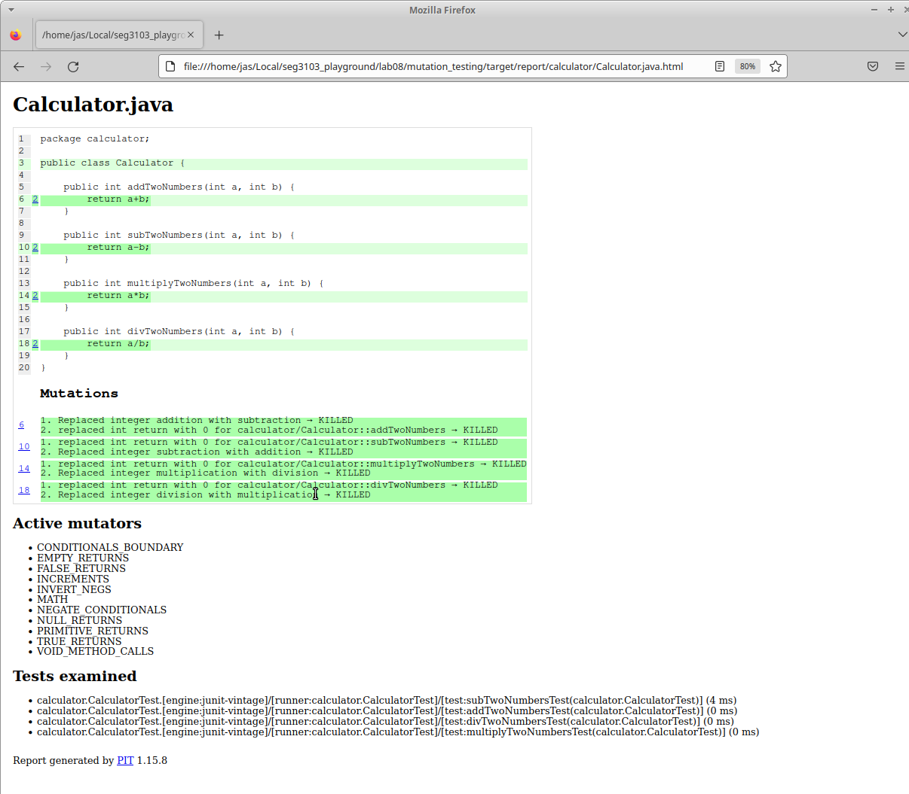

# Mutation Testing

First, I downloaded and ran IntelliJ IDEA.  
Then, I installed the PIT Mutation Plugin.  
Next, I added the JUnit jar to dependencies.

## Starting PIT Test Plugin

# PIT Test Coverage Report

## HTML Project Summary Report

## HTML Package Report

## HTML Class Report

# Questions:

## In your own words, explain what the various mutations are doing and what the report tells you.

On line 6 when testing addTwoNumbers(), the mutation tried to replace addition with subtraction and return with 0, both of these were killed.  
On line 10 when testing subTwoNumbers(), the mutation tried to return with 0 and replace subtraction with addition, both of these were also killed.  
On line 14 when testing multiplyTwoNumbers(), the mutation tried to return with 0 and replace multiplication with division, both of these were killed.  
On line 18 when testing divTwoNumbers(), the mutation tried to return with 0 and replace division with multiplication, both of these were also killed.

The report also tells you the active mutators, which run by default when running a mutation coverage test. They are:  

- CONDITIONALS_BOUNDARY
- EMPTY_RETURNS
- FALSE_RETURNS
- INCREMENTS
- INVERT_NEGS
- MATH
- NEGATE_CONDITIONALS
- NULL_RETURNS
- PRIMITIVE_RETURNS
- TRUE_RETURNS
- VOID_METHOD_CALLS

## Explain what it means for a mutant to be killed.

When a mutant is killed, it means this mutation did not pass the test which is what we are aiming for.